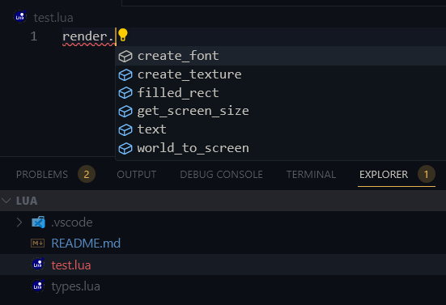

# WeaveSnippet

[Documentation](https://docs.weave.su/)
[Documentation Repository](https://github.com/Quadro1337/weave-docs)

### How to install?

-   Download [lua-language-server](https://luals.github.io):

    -   [Visual Studio Code](https://marketplace.visualstudio.com/items?itemName=sumneko.lua)

-   Download [types.lua](https://github.com/MasedMSD/WeaveSnippet/blob/main/types.lua) and put it into `weave/lua`
-   Done!

### How it looks?

### Todo

-   [ ] Generics Support
-   [x] Description for methods
